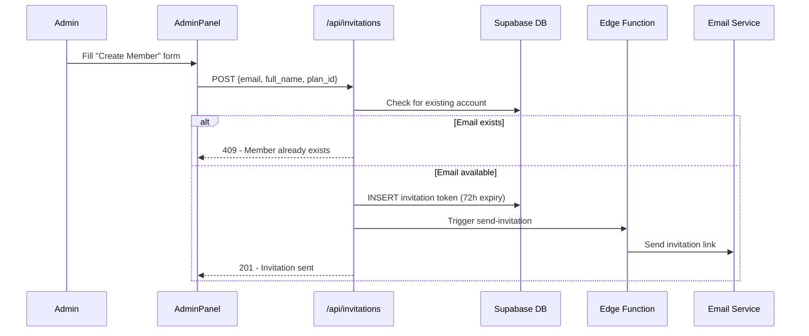
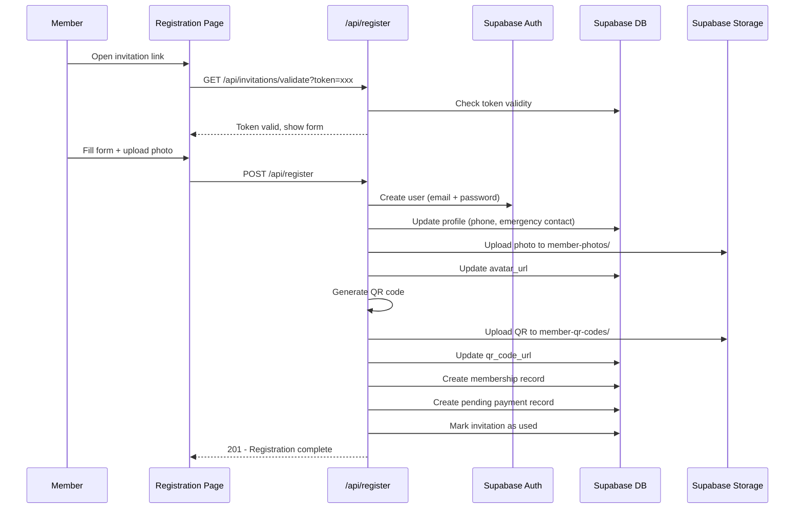

# Design Document: Gym Modernization

## Overview

This design covers the comprehensive modernization of the GymFlow application, transforming it from a light-themed, manually-driven system into a dark blue lightning-themed, automated gym management platform. The modernization spans eight key areas: theming, admin-initiated registration, member password setup, mandatory photo upload, QR code generation, automated registration orchestration, QR-based attendance check-in, and a modernized dashboard.

The system is built on Next.js (App Router) with Supabase (Postgres, Auth, Storage) and Tailwind CSS v4. The design extends the existing schema with new tables for invitation tokens and QR codes, introduces new service layers for registration orchestration, and replaces the current light theme with a dark blue lightning aesthetic.

### Key Design Decisions

1. **Invitation-based registration**: Members cannot self-register. Admins create invitation tokens that authorize email-specific registration, stored in a new `invitations` table.
2. **QR code generation via client-side library**: Using the `qrcode` npm package to generate QR codes as PNG data URLs, stored in Supabase Storage. No external API dependency.
3. **Theme as Tailwind v4 CSS variables**: The dark blue lightning theme is implemented entirely through Tailwind CSS `@theme` configuration in `globals.css`, replacing the current light theme tokens.
4. **Camera-based QR scanning**: Using the `html5-qrcode` library for browser-based QR code scanning on the attendance page.
5. **Supabase Edge Functions for email**: Invitation emails are sent via a Supabase Edge Function that interfaces with Supabase's built-in email service or a configured SMTP provider.

## Architecture

```mermaid
graph TB
    subgraph "Client (Next.js App Router)"
        A[Admin Panel] --> B[Registration Service API]
        C[Member Registration Page] --> B
        D[Attendance Scanner] --> E[Attendance API]
        F[Dashboard Pages] --> G[Supabase Client]
    end

    subgraph "API Layer (Route Handlers)"
        B --> H[/api/invitations]
        B --> I[/api/register]
        E --> J[/api/attendance/check-in]
        K[/api/qr/generate]
    end

    subgraph "Supabase Backend"
        H --> L[(PostgreSQL)]
        I --> L
        I --> M[Supabase Auth]
        I --> N[Supabase Storage]
        J --> L
        K --> N
        O[Edge Function: send-invitation] --> P[Email Service]
    end

    subgraph "Storage Buckets"
        N --> Q[member-photos]
        N --> R[member-qr-codes]
    end
```

### Request Flow: Admin Creates Member



### Request Flow: Member Completes Registration



## Components and Interfaces

### New API Route Handlers

| Route | Method | Purpose |
|-------|--------|---------|
| `/api/invitations` | POST | Admin creates invitation |
| `/api/invitations` | GET | Admin lists pending invitations |
| `/api/invitations/validate` | GET | Validate token for registration page |
| `/api/invitations/[id]/resend` | POST | Resend expired invitation |
| `/api/register` | POST | Complete member registration |
| `/api/attendance/qr-check-in` | POST | Process QR code scan for attendance |
| `/api/qr/generate` | POST | Generate/regenerate QR code for member |

### New Page Components

| Page | Path | Description |
|------|------|-------------|
| Admin: Create Member | `/dashboard/members/invite` | Form for admin to initiate member registration |
| Admin: Invitations List | `/dashboard/members/invitations` | Paginated list of pending/sent invitations |
| Member Registration | `/register/complete` | Invitation-based registration with photo + password |
| Registration Success | `/register/success` | Shows QR code and completion message |

### New Shared Components

| Component | Location | Purpose |
|-----------|----------|---------|
| `QRScanner` | `src/components/attendance/qr-scanner.tsx` | Camera-based QR code reader |
| `PhotoUpload` | `src/components/registration/photo-upload.tsx` | Camera capture + file upload with preview |
| `QRCodeDisplay` | `src/components/ui/qr-code-display.tsx` | QR code renderer with download option |
| `LightningBolt` | `src/components/ui/lightning-bolt.tsx` | Decorative SVG lightning element |
| `GlowCard` | `src/components/ui/glow-card.tsx` | Card with gradient background and hover glow |
| `MetricCard` | `src/components/dashboard/metric-card.tsx` | Dashboard stat card with gradient + glow |
| `MemberProfileCard` | `src/components/dashboard/member-profile-card.tsx` | Compact member card with photo, QR, status |
| `InvitationForm` | `src/components/members/invitation-form.tsx` | Admin form for creating member invitations |

### Service Modules

| Module | Path | Responsibility |
|--------|------|----------------|
| `registration-service` | `src/lib/services/registration.ts` | Orchestrates full registration flow |
| `qr-service` | `src/lib/services/qr.ts` | QR code generation and storage |
| `invitation-service` | `src/lib/services/invitation.ts` | Token creation, validation, email trigger |
| `photo-service` | `src/lib/services/photo.ts` | Photo validation, upload, URL management |
| `membership-service` | `src/lib/services/membership.ts` | Auto-assigns membership, calculates dates |

### External Dependencies (New)

| Package | Version | Purpose |
|---------|---------|---------|
| `qrcode` | `^1.5.3` | QR code generation as PNG/data URL |
| `html5-qrcode` | `^2.3.8` | Browser-based QR code scanning |
| `@types/qrcode` | `^1.5.5` | TypeScript types for qrcode |

## Data Models

### New Table: `invitations`

```sql
CREATE TYPE public.invitation_status AS ENUM ('sent', 'accepted', 'expired');

CREATE TABLE public.invitations (
  id UUID PRIMARY KEY DEFAULT gen_random_uuid(),
  email TEXT NOT NULL,
  full_name TEXT NOT NULL,
  plan_id UUID REFERENCES public.membership_plans(id) ON DELETE RESTRICT NOT NULL,
  token TEXT NOT NULL UNIQUE,
  status public.invitation_status DEFAULT 'sent' NOT NULL,
  invited_by UUID REFERENCES public.profiles(id) ON DELETE SET NULL NOT NULL,
  expires_at TIMESTAMPTZ NOT NULL,
  accepted_at TIMESTAMPTZ,
  created_at TIMESTAMPTZ DEFAULT now() NOT NULL
);

CREATE INDEX idx_invitations_token ON public.invitations(token);
CREATE INDEX idx_invitations_email ON public.invitations(email);
CREATE INDEX idx_invitations_status ON public.invitations(status);
```

### Profile Table Extension

```sql
ALTER TABLE public.profiles
  ADD COLUMN qr_code_url TEXT;
```

### New Storage Buckets

| Bucket | Access | Purpose |
|--------|--------|---------|
| `member-photos` | Private (RLS via policies) | Member profile photos |
| `member-qr-codes` | Private (RLS via policies) | Generated QR code images |

### New RLS Policies

```sql
-- Invitations: Only admins can manage
ALTER TABLE public.invitations ENABLE ROW LEVEL SECURITY;

CREATE POLICY "Admins can manage invitations"
  ON public.invitations FOR ALL
  USING (public.get_user_role() = 'admin');

-- Storage policies for member-photos bucket
-- Members can read their own photo, admins/trainers can read all
-- Registration API uses service role for initial upload
```

### TypeScript Type Extensions

```typescript
export type InvitationStatus = "sent" | "accepted" | "expired";

export interface Invitation {
  id: string;
  email: string;
  full_name: string;
  plan_id: string;
  token: string;
  status: InvitationStatus;
  invited_by: string;
  expires_at: string;
  accepted_at: string | null;
  created_at: string;
}

// Extended Profile type
export interface Profile {
  // ...existing fields
  qr_code_url: string | null;
}
```

### Theme Configuration (globals.css replacement)

```css
@import "tailwindcss";

@theme {
  /* Dark Blue Lightning Theme */
  --color-primary: #2563eb;
  --color-primary-foreground: #ffffff;
  --color-secondary: #1e293b;
  --color-secondary-foreground: #cbd5e1;
  --color-accent: #38bdf8;
  --color-accent-yellow: #fbbf24;
  --color-destructive: #ef4444;
  --color-muted: #94a3b8;
  --color-border: #1e3a5f;
  --color-background: #0a1628;
  --color-foreground: #ffffff;
  --color-card: #1e3a5f;
  --color-card-foreground: #ffffff;
  --color-success: #10b981;
  --color-warning: #f59e0b;
  --radius-sm: 0.375rem;
  --radius-md: 0.5rem;
  --radius-lg: 0.75rem;
}

@layer base {
  body {
    @apply bg-background text-foreground antialiased;
  }
}

@layer utilities {
  .glow-blue {
    box-shadow: 0 0 12px rgba(56, 189, 248, 0.4);
  }
  .glow-blue-lg {
    box-shadow: 0 0 20px rgba(56, 189, 248, 0.5);
  }
}
```

## Correctness Properties

*A property is a characteristic or behavior that should hold true across all valid executions of a system — essentially, a formal statement about what the system should do. Properties serve as the bridge between human-readable specifications and machine-verifiable correctness guarantees.*

### Property 1: Invitation token validation

*For any* invitation token, if it is expired (created more than 72 hours ago), already used (status = 'accepted'), or does not exist, then the registration validation endpoint SHALL reject the request and return an error indicating the token is invalid.

**Validates: Requirements 2.3, 2.4**

### Property 2: Admin form input validation

*For any* Create Member Account form submission where the email is not a valid email format or exceeds 254 characters, or the full name is empty or exceeds 100 characters, or the plan ID does not reference an active plan, then the system SHALL reject the submission with field-specific validation errors.

**Validates: Requirements 2.7**

### Property 3: Password validation

*For any* string submitted as a password, the validation function SHALL accept it if and only if it has between 8 and 72 characters inclusive AND contains at least one uppercase letter AND at least one lowercase letter AND at least one numeric digit.

**Validates: Requirements 3.3**

### Property 4: Phone number validation

*For any* string submitted as a phone number, the validation function SHALL accept it if and only if it contains between 7 and 15 digit characters inclusive.

**Validates: Requirements 3.4**

### Property 5: Photo file validation

*For any* file submitted for photo upload, the validation function SHALL accept it if and only if its MIME type is one of image/jpeg, image/png, or image/webp AND its dimensions are at least 200×200 pixels AND its file size is greater than 0 bytes and at most 5 MB.

**Validates: Requirements 4.2**

### Property 6: Photo storage path construction

*For any* member profile ID (UUID) and valid image file extension (jpg, png, webp), the storage path SHALL be exactly `member-photos/{member_id}.{extension}`.

**Validates: Requirements 4.6**

### Property 7: QR code round-trip encoding

*For any* valid UUID string representing a member profile ID, generating a QR code from that UUID and then decoding the resulting QR image SHALL produce the exact same UUID string.

**Validates: Requirements 5.1**

### Property 8: Registration creates correct membership and payment

*For any* completed registration where the invitation references a membership plan with a given price, the system SHALL create a membership record with the correct plan_id AND a payment record with amount equal to the plan's price, status "pending", and method "other".

**Validates: Requirements 6.3, 6.6**

### Property 9: Membership date calculation

*For any* registration completion date and membership plan with a given duration_days value, the created membership record SHALL have start_date equal to the registration date and end_date equal to start_date plus exactly duration_days calendar days.

**Validates: Requirements 6.5**

### Property 10: Membership expiry detection

*For any* membership with status "active" whose end_date is strictly before the current date, the expiry check function SHALL identify it as expired and update its status to "expired".

**Validates: Requirements 6.8**

### Property 11: Active member QR check-in creates attendance

*For any* member with an active membership status who has not already checked in today, scanning their valid QR code SHALL create a new attendance record with check_in_time set to the current server timestamp and check_out_time set to null.

**Validates: Requirements 7.2**

### Property 12: Non-active membership prevents check-in

*For any* member whose membership status is "expired", "frozen", or "cancelled", scanning their QR code SHALL NOT create an attendance record and SHALL return a rejection indicating the membership status.

**Validates: Requirements 7.3**

### Property 13: Duplicate check-in records checkout

*For any* member who has an existing attendance record from today (same calendar day, server timezone) with a null check_out_time, scanning their QR code SHALL update the existing record's check_out_time to the current server timestamp instead of creating a new attendance record.

**Validates: Requirements 7.4**

### Property 14: Invalid QR code rejection

*For any* string that is either not a valid UUID format or is a valid UUID that does not match any existing member profile ID in the system, the check-in endpoint SHALL reject it with an "unrecognized code" error.

**Validates: Requirements 7.6**

### Property 15: Member profile card renders available fields

*For any* member profile data object, the profile card component SHALL render the member's name and membership status badge, AND SHALL render the photo if avatar_url is non-null (or a default placeholder if null), AND SHALL render the QR code thumbnail if qr_code_url is non-null (or a placeholder icon if null).

**Validates: Requirements 8.5**

## Error Handling

### Registration Flow Errors

| Error Scenario | User-Facing Behavior | System Behavior |
|---------------|---------------------|-----------------|
| Invalid invitation token | "This invitation link is no longer valid. Please contact your gym administrator." | Log attempt, no state change |
| Email already registered | "A member with this email already exists." (admin side) | Return 409 Conflict |
| Photo upload too large | "Photo must be under 5 MB. Please select a smaller file." | Retain form data, reject upload |
| Photo wrong format | "Please upload a JPEG, PNG, or WebP image." | Retain form data, reject upload |
| Photo too small | "Photo must be at least 200×200 pixels." | Retain form data, reject upload |
| Storage upload failure | "Upload failed. Please try again." | Retain photo + form data, allow retry |
| QR generation failure | Silent retry (3 attempts) → "QR code is being generated" | Queue background job after 3 failures |
| Registration transaction failure | "Registration failed: [reason]. Please try again." | Rollback transaction, retain form data (except password) |
| Invitation email send failure | "Failed to send invitation. Please try again." (admin) | Log error, allow retry |
| Password too weak | "Password must be 8-72 characters with at least one uppercase, one lowercase, and one number." | Reject submission, retain other fields |

### Attendance Check-In Errors

| Error Scenario | User-Facing Behavior | System Behavior |
|---------------|---------------------|-----------------|
| Unrecognized QR code | "Unrecognized code. Please try again." → return to scanner in 3s | Log scan attempt |
| Expired membership | "Membership expired. Please contact front desk." + status badge | Prevent attendance record creation |
| Frozen membership | "Membership frozen. Please contact admin." | Prevent attendance record creation |
| Cancelled membership | "Membership cancelled. Please contact admin." | Prevent attendance record creation |
| Camera unavailable | Hide scanner, show manual check-in option | Fallback to dropdown selection |
| Network error during scan | "Connection error. Please try again." | Retry on next scan |

### Global Error Patterns

- All API routes return structured error responses: `{ error: string, field?: string }`
- Client-side forms preserve entered data on error (except passwords)
- Toast notifications for transient errors (network, timeout)
- Inline field errors for validation failures
- Full-page error states for broken flows (invalid tokens, unauthorized access)

## Testing Strategy

### Testing Framework

- **Unit tests**: Vitest (already compatible with Next.js + TypeScript)
- **Property-based tests**: `fast-check` library with Vitest
- **Component tests**: React Testing Library + Vitest
- **Integration tests**: Vitest with Supabase local emulator

### Property-Based Tests (fast-check)

Each correctness property maps to a single property-based test with a minimum of 100 iterations.

| Property | Test File | Tag |
|----------|-----------|-----|
| 1: Token validation | `src/lib/services/__tests__/invitation.property.test.ts` | Feature: gym-modernization, Property 1: Invitation token validation |
| 2: Form input validation | `src/lib/services/__tests__/invitation.property.test.ts` | Feature: gym-modernization, Property 2: Admin form input validation |
| 3: Password validation | `src/lib/services/__tests__/registration.property.test.ts` | Feature: gym-modernization, Property 3: Password validation |
| 4: Phone validation | `src/lib/services/__tests__/registration.property.test.ts` | Feature: gym-modernization, Property 4: Phone number validation |
| 5: Photo validation | `src/lib/services/__tests__/photo.property.test.ts` | Feature: gym-modernization, Property 5: Photo file validation |
| 6: Storage path | `src/lib/services/__tests__/photo.property.test.ts` | Feature: gym-modernization, Property 6: Photo storage path construction |
| 7: QR round-trip | `src/lib/services/__tests__/qr.property.test.ts` | Feature: gym-modernization, Property 7: QR code round-trip encoding |
| 8: Membership + payment | `src/lib/services/__tests__/registration.property.test.ts` | Feature: gym-modernization, Property 8: Registration creates correct membership and payment |
| 9: Date calculation | `src/lib/services/__tests__/membership.property.test.ts` | Feature: gym-modernization, Property 9: Membership date calculation |
| 10: Expiry detection | `src/lib/services/__tests__/membership.property.test.ts` | Feature: gym-modernization, Property 10: Membership expiry detection |
| 11: Check-in creates attendance | `src/lib/services/__tests__/attendance.property.test.ts` | Feature: gym-modernization, Property 11: Active member QR check-in |
| 12: Non-active rejection | `src/lib/services/__tests__/attendance.property.test.ts` | Feature: gym-modernization, Property 12: Non-active membership prevents check-in |
| 13: Duplicate check-in | `src/lib/services/__tests__/attendance.property.test.ts` | Feature: gym-modernization, Property 13: Duplicate check-in records checkout |
| 14: Invalid QR rejection | `src/lib/services/__tests__/attendance.property.test.ts` | Feature: gym-modernization, Property 14: Invalid QR code rejection |
| 15: Profile card fields | `src/components/dashboard/__tests__/member-profile-card.property.test.ts` | Feature: gym-modernization, Property 15: Member profile card renders available fields |

### Unit Tests (Example-Based)

| Area | Test Focus |
|------|-----------|
| Theme tokens | Verify CSS variables contain expected color values |
| WCAG contrast | Compute and verify contrast ratios for all color pairs |
| Lightning SVG | Verify opacity, dimensions, pointer-events props |
| Invitation list | Pagination at 50 items, status display |
| Registration form | Pre-fill email from valid token |
| Camera fallback | Hide camera when MediaDevices unavailable |
| Photo preview | Renders at 150×150 minimum |
| QR retry logic | Verify 3 retries with delay |
| Dashboard rendering | Role-based metric cards and content |
| Responsive grid | Breakpoint class verification |

### Integration Tests

| Flow | Test Scope |
|------|-----------|
| Full registration | Admin invite → member opens link → completes form → profile + membership + payment created |
| QR check-in | Scan QR → validate membership → create attendance |
| Membership expiry | Cron/trigger updates expired memberships |
| Email sending | Invitation triggers edge function (mocked SMTP) |

### Test Configuration

```typescript
// vitest.config.ts additions
export default defineConfig({
  test: {
    // fast-check default iterations
    fuzz: { iterations: 100 }
  }
});
```

Each property test file uses:
```typescript
import fc from 'fast-check';
import { test, expect } from 'vitest';

test('Property N: [title]', () => {
  fc.assert(
    fc.property(/* arbitraries */, (input) => {
      // Feature: gym-modernization, Property N: [property text]
      // ... assertions
    }),
    { numRuns: 100 }
  );
});
```

